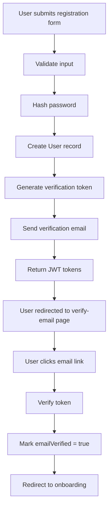
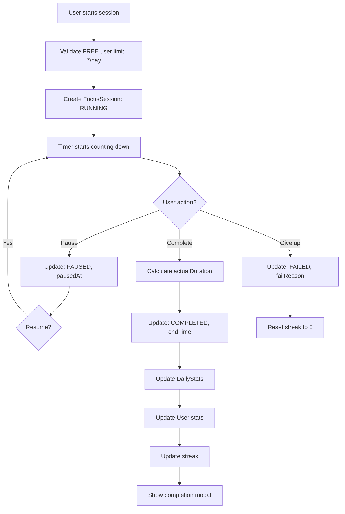
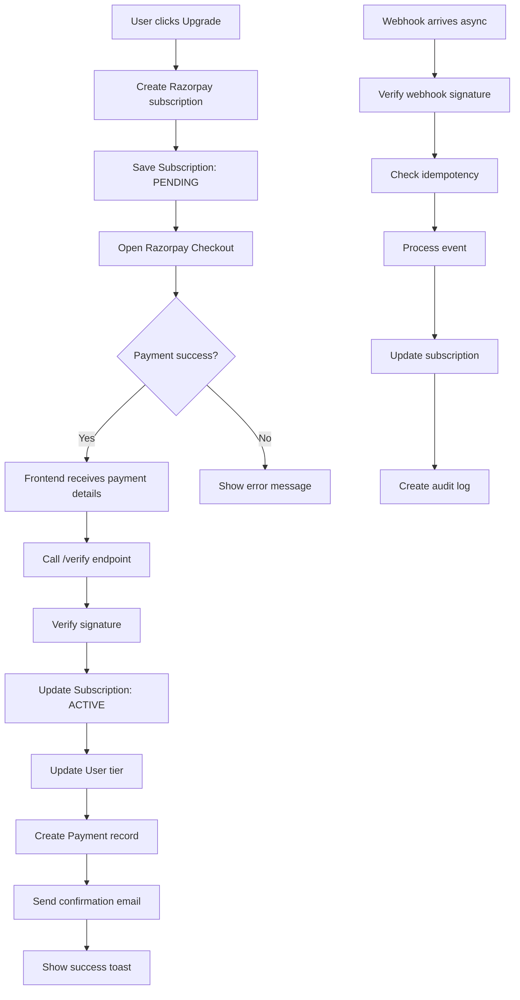
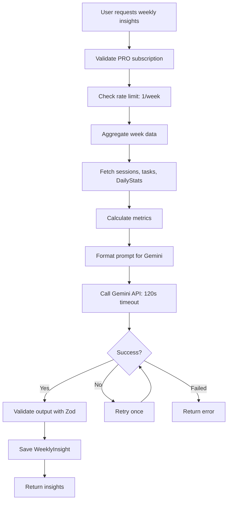

# Forest - AI-Powered Focus Timer Application

## PROJECT OVERVIEW

**Forest** is a premium productivity application that gamifies focused work sessions through tree-growing animations. Users start focus sessions, watch virtual trees grow, and build a forest of their productivity achievements.

### Technology Stack

**Frontend:**

- Next.js 14 (App Router, TypeScript)
- Tailwind CSS + Framer Motion
- Axios, React Hook Form, Zod
- Recharts for analytics visualization

**Backend:**

- Express.js (TypeScript)
- MongoDB + Prisma ORM
- JWT Authentication
- Google Gemini AI (via LangChain)
- Razorpay Payment Gateway

**Deployment:**

- Monorepo structure (pnpm workspaces)
- Environment: Node.js 18+

---

## ARCHITECTURE

### Monorepo Structure

```
forest/
├── apps/
│   ├── web/          # Next.js frontend application
│   └── server/       # Express.js backend API
├── packages/         # Shared packages (future use)
└── pnpm-workspace.yaml
```

### Backend Architecture

**Three-Layer Architecture:**

```
Routes → Controllers → Services → Prisma (Database)
```

**Directory Structure:**

```
apps/server/src/
├── config/           # Environment configuration
├── controllers/      # Request handlers (7 controllers)
├── routes/           # API route definitions
├── services/         # Business logic layer (8 services)
├── middleware/       # Auth, validation, rate limiting
├── validators/       # Zod validation schemas
├── types/            # TypeScript type definitions
├── utils/            # Helper functions
└── lib/              # Prisma client instance
```

### Frontend Architecture

**App Router Structure:**

```
app/
├── (auth)/           # Public authentication pages
├── (dashboard)/      # Protected dashboard routes
├── pricing/          # Subscription pricing page
└── [auth-flows]/     # Verification, password reset
```

**Component Organization:**

```
components/
├── ui/               # Base reusable components (Button, Card, Input, Modal)
├── auth/             # Authentication forms
├── dashboard/        # Dashboard-specific widgets
├── tasks/            # Task management components
├── session/          # Focus session components
├── forest/           # Forest visualization
├── insights/         # Analytics and insights
├── subscription/     # Payment and subscription UI
└── shared/           # Cross-feature components (Header, Sidebar)
```

---

## DATABASE SCHEMA

### Core Models

#### 1. User Model

```prisma
model User {
  id                String    @id @default(auto()) @map("_id") @db.ObjectId
  email             String    @unique
  name              String
  password          String
  emailVerified     Boolean   @default(false)
  emailVerificationToken String?
  emailVerificationExpiry DateTime?
  passwordResetToken String?
  passwordResetExpiry DateTime?
  avatar            String?
  timezone          String    @default("UTC")
  preferences       Json?     # User settings (focus duration, sound, etc.)

  # Gamification
  totalFocusTime    Int       @default(0)  # Total seconds focused
  currentStreak     Int       @default(0)  # Consecutive days
  longestStreak     Int       @default(0)
  lastSessionDate   DateTime?
  totalSessions     Int       @default(0)

  # Subscription
  subscriptionTier  SubscriptionTier @default(FREE)
  subscriptionStatus SubscriptionStatus @default(INACTIVE)
  subscriptionId    String?   # Razorpay subscription ID
  currentPeriodStart DateTime?
  currentPeriodEnd  DateTime?

  # AI Usage Tracking
  aiRequestsThisMonth Int     @default(0)
  aiRequestsResetDate DateTime?

  # Onboarding
  onboardingCompleted Boolean @default(false)
  userType          String?   # student, professional, freelancer
  preferredFocusTime String?  # morning, afternoon, evening, night
  defaultSessionDuration Int?  # minutes

  # Relationships
  tasks             Task[]
  sessions          FocusSession[]
  insights          WeeklyInsight[]
  dailyStats        DailyStats[]
  achievements      UserAchievement[]
  subscription      Subscription?
  payments          Payment[]
  aiRequests        AIRequest[]

  createdAt         DateTime  @default(now())
  updatedAt         DateTime  @updatedAt
}
```

**Key Fields:**

- `subscriptionTier`: FREE | PRO_MONTHLY | PRO_YEARLY
- `subscriptionStatus`: INACTIVE | ACTIVE | CANCELLED | EXPIRED
- `aiRequestsThisMonth`: Rate limiting (FREE = 3/month, PRO = unlimited)

#### 2. Task Model

```prisma
model Task {
  id              String      @id @default(auto()) @map("_id") @db.ObjectId
  userId          String      @db.ObjectId
  user            User        @relation(fields: [userId], references: [id], onDelete: Cascade)

  title           String
  description     String?
  status          TaskStatus  @default(TODO)  # TODO, IN_PROGRESS, COMPLETED, ARCHIVED
  priority        TaskPriority @default(MEDIUM)  # LOW, MEDIUM, HIGH, URGENT
  dueDate         DateTime?
  estimatedMinutes Int?
  tags            String[]    @default([])

  # AI Breakdown
  aiBreakdown     Json?       # Array of subtask objects
  aiBreakdownGeneratedAt DateTime?

  # Relationships
  sessions        FocusSession[]

  createdAt       DateTime    @default(now())
  updatedAt       DateTime    @updatedAt
}
```

**AI Breakdown Structure:**

```typescript
{
  subtasks: Array<{
    title: string;
    description: string;
    estimatedMinutes: number;
    order: number;
  }>;
}
```

#### 3. FocusSession Model

```prisma
model FocusSession {
  id              String      @id @default(auto()) @map("_id") @db.ObjectId
  userId          String      @db.ObjectId
  user            User        @relation(fields: [userId], references: [id], onDelete: Cascade)
  taskId          String?     @db.ObjectId
  task            Task?       @relation(fields: [taskId], references: [id])

  # Session Configuration
  plannedDuration Int         # Planned duration in seconds
  actualDuration  Int         @default(0)  # Actual focused time in seconds
  status          SessionStatus @default(RUNNING)  # RUNNING, PAUSED, COMPLETED, FAILED

  # Timing
  startTime       DateTime    @default(now())
  endTime         DateTime?
  pausedAt        DateTime?
  resumedAt       DateTime?
  totalPausedTime Int         @default(0)  # Total paused seconds

  # Failure Tracking
  failReason      SessionFailReason?  # USER_GAVE_UP, APP_BACKGROUNDED, DISTRACTION_OPENED, TIMEOUT

  # Session Data
  notes           String?
  tags            String[]    @default([])

  # Tree Visualization
  treeType        String?     # basic, premium, elite (based on duration)

  createdAt       DateTime    @default(now())
  updatedAt       DateTime    @updatedAt
}
```

**Session States:**

- RUNNING: Timer is active
- PAUSED: Timer is paused
- COMPLETED: Session finished successfully
- FAILED: Session was interrupted or abandoned

**Tree Tiers:**

- Basic: 0-15 minutes
- Premium: 15-45 minutes
- Elite: 45+ minutes

#### 4. DailyStats Model

```prisma
model DailyStats {
  id                  String   @id @default(auto()) @map("_id") @db.ObjectId
  userId              String   @db.ObjectId
  user                User     @relation(fields: [userId], references: [id], onDelete: Cascade)
  date                DateTime # Start of day (midnight UTC)

  # Aggregate Stats
  totalFocusTime      Int      @default(0)  # Seconds focused
  sessionsCompleted   Int      @default(0)
  sessionsFailed      Int      @default(0)
  tasksCompleted      Int      @default(0)
  currentStreak       Int      @default(0)

  # Breakdown
  sessionsByHour      Json?    # { "0": 0, "1": 2, ... "23": 0 }
  tasksByPriority     Json?    # { "LOW": 1, "MEDIUM": 3, "HIGH": 2 }

  createdAt           DateTime @default(now())
  updatedAt           DateTime @updatedAt

  @@unique([userId, date])
}
```

**Purpose:** Pre-aggregated daily metrics for fast dashboard queries

#### 5. WeeklyInsight Model

```prisma
model WeeklyInsight {
  id                String   @id @default(auto()) @map("_id") @db.ObjectId
  userId            String   @db.ObjectId
  user              User     @relation(fields: [userId], references: [id], onDelete: Cascade)

  weekStartDate     DateTime # Monday of the week
  weekEndDate       DateTime # Sunday of the week

  # AI Generated Content
  summary           String   # Narrative summary
  insights          Json     # Array of insight objects
  recommendations   Json     # Array of recommendation objects
  nextWeekPlan      Json     # Planning suggestions
  keyTakeaway       String?  # "One lever to pull"

  # Metrics
  totalFocusTime    Int      # Seconds
  sessionsCompleted Int
  completionRate    Float
  peakProductivityHour Int?

  # Meta
  isRead            Boolean  @default(false)
  generatedAt       DateTime @default(now())

  createdAt         DateTime @default(now())
  updatedAt         DateTime @updatedAt

  @@unique([userId, weekStartDate])
}
```

**Insights JSON Structure:**

```typescript
{
  insights: Array<{
    category: string;
    title: string;
    description: string;
    metric?: { label: string; value: string; };
  }>,
  recommendations: Array<{
    title: string;
    description: string;
    priority: "high" | "medium" | "low";
    actionable: boolean;
  }>,
  nextWeekPlan: {
    goals: string[];
    focusAreas: string[];
    experimentsToTry: string[];
  }
}
```

### Subscription Models

#### 6. Subscription Model

```prisma
model Subscription {
  id                  String   @id @default(auto()) @map("_id") @db.ObjectId
  userId              String   @unique @db.ObjectId
  user                User     @relation(fields: [userId], references: [id], onDelete: Cascade)

  # Razorpay Integration
  razorpaySubscriptionId String @unique
  razorpayPlanId      String
  razorpayCustomerId  String?

  # Subscription Details
  tier                SubscriptionTier  # FREE, PRO_MONTHLY, PRO_YEARLY
  status              SubscriptionStatus # ACTIVE, CANCELLED, EXPIRED, PENDING

  # Billing Cycle
  currentPeriodStart  DateTime
  currentPeriodEnd    DateTime
  billingCycleAnchor  DateTime?

  # Lifecycle
  startedAt           DateTime
  cancelledAt         DateTime?
  expiredAt           DateTime?

  # Trial (if applicable)
  trialStart          DateTime?
  trialEnd            DateTime?

  # Metadata
  metadata            Json?

  createdAt           DateTime @default(now())
  updatedAt           DateTime @updatedAt
}
```

#### 7. Payment Model

```prisma
model Payment {
  id                  String   @id @default(auto()) @map("_id") @db.ObjectId
  userId              String   @db.ObjectId
  user                User     @relation(fields: [userId], references: [id], onDelete: Cascade)

  # Razorpay IDs
  razorpayPaymentId   String   @unique
  razorpayOrderId     String?
  razorpaySubscriptionId String?
  razorpaySignature   String?

  # Payment Details
  amount              Int      # Amount in paise (Indian currency)
  currency            String   @default("INR")
  status              PaymentStatus # PENDING, SUCCESS, FAILED, REFUNDED
  method              PaymentMethod? # CARD, UPI, NETBANKING, WALLET

  # Failure Details
  errorCode           String?
  errorDescription    String?

  # Receipt
  receipt             String?
  invoiceId           String?

  # Metadata
  metadata            Json?

  createdAt           DateTime @default(now())
  updatedAt           DateTime @updatedAt
}
```

#### 8. WebhookEvent Model

```prisma
model WebhookEvent {
  id                String   @id @default(auto()) @map("_id") @db.ObjectId
  razorpayEventId   String   @unique  # For idempotency
  eventType         RazorpayEventType
  payload           Json
  processed         Boolean  @default(false)
  processingError   String?
  createdAt         DateTime @default(now())
  processedAt       DateTime?
}
```

**Purpose:** Idempotency for webhook processing (prevent duplicate processing)

### Supporting Models

#### 9. AIRequest Model

```prisma
model AIRequest {
  id              String   @id @default(auto()) @map("_id") @db.ObjectId
  userId          String   @db.ObjectId
  user            User     @relation(fields: [userId], references: [id], onDelete: Cascade)

  requestType     String   # task_breakdown, weekly_insights
  tokensUsed      Int?
  durationMs      Int?     # Request duration in milliseconds
  status          String   # success, error
  errorMessage    String?

  createdAt       DateTime @default(now())
}
```

**Purpose:** Track AI API usage for rate limiting and analytics

#### 10. PlanConfiguration Model

```prisma
model PlanConfiguration {
  id                    String   @id @default(auto()) @map("_id") @db.ObjectId
  tier                  SubscriptionTier @unique
  name                  String
  displayName           String

  # Pricing
  price                 Int      # Amount in paise
  currency              String   @default("INR")
  billingPeriod         String   # monthly, yearly

  # Features
  maxSessionsPerDay     Int?     # null = unlimited
  maxAIRequestsPerMonth Int?     # null = unlimited
  maxDevices            Int      @default(1)
  advancedInsights      Boolean  @default(false)
  prioritySupport       Boolean  @default(false)

  # Razorpay
  razorpayPlanId        String   @unique

  # Status
  isActive              Boolean  @default(true)

  createdAt             DateTime @default(now())
  updatedAt             DateTime @updatedAt
}
```

#### 11. SubscriptionAuditLog Model

```prisma
model SubscriptionAuditLog {
  id                String   @id @default(auto()) @map("_id") @db.ObjectId
  userId            String   @db.ObjectId
  subscriptionId    String?
  action            SubscriptionAction  # CREATED, ACTIVATED, RENEWED, CANCELLED, EXPIRED, UPGRADED, DOWNGRADED
  previousTier      SubscriptionTier?
  newTier           SubscriptionTier?
  metadata          Json?
  createdAt         DateTime @default(now())
}
```

#### 12. UserAchievement Model

```prisma
model UserAchievement {
  id              String   @id @default(auto()) @map("_id") @db.ObjectId
  userId          String   @db.ObjectId
  user            User     @relation(fields: [userId], references: [id], onDelete: Cascade)
  achievementId   String   # Reference to achievement definition
  unlockedAt      DateTime @default(now())
  progress        Int?     # For progressive achievements

  @@unique([userId, achievementId])
}
```

---

## API DOCUMENTATION

### Base URL

```
Development: http://localhost:8080/api
Production: [Your production URL]/api
```

### Authentication

All protected endpoints require JWT Bearer token:

```
Authorization: Bearer <access_token>
```

**Token Refresh:**

- Access token expires in 15 minutes
- Refresh token expires in 7 days
- Use `/api/auth/refresh` to obtain new access token

### Response Format

**Success Response:**

```json
{
  "success": true,
  "data": { ... },
  "message": "Operation successful"
}
```

**Error Response:**

```json
{
  "success": false,
  "error": {
    "code": "VALIDATION_ERROR",
    "message": "Invalid input data",
    "details": { ... }
  }
}
```

---

## API ENDPOINTS

### 1. Authentication Endpoints (`/api/auth`)

#### POST /api/auth/register

Register a new user.

**Request Body:**

```json
{
  "email": "user@example.com",
  "name": "John Doe",
  "password": "SecurePass123!"
}
```

**Validation:**

- Email: Valid email format, unique
- Name: 2-50 characters
- Password: Min 8 characters, 1 uppercase, 1 lowercase, 1 number

**Response (201):**

```json
{
  "success": true,
  "data": {
    "user": {
      "id": "...",
      "email": "user@example.com",
      "name": "John Doe",
      "emailVerified": false
    },
    "accessToken": "eyJhbGc...",
    "refreshToken": "eyJhbGc..."
  }
}
```

**Side Effects:**

- Sends verification email
- Creates initial DailyStats record

---

#### POST /api/auth/login

Login with email and password.

**Request Body:**

```json
{
  "email": "user@example.com",
  "password": "SecurePass123!"
}
```

**Response (200):**

```json
{
  "success": true,
  "data": {
    "user": { ... },
    "accessToken": "...",
    "refreshToken": "..."
  }
}
```

**Errors:**

- 401: Invalid credentials
- 403: Email not verified

---

#### POST /api/auth/refresh

Refresh access token.

**Request Body:**

```json
{
  "refreshToken": "eyJhbGc..."
}
```

**Response (200):**

```json
{
  "success": true,
  "data": {
    "accessToken": "new_access_token",
    "refreshToken": "new_refresh_token"
  }
}
```

---

#### POST /api/auth/logout

Logout user (invalidate refresh token).

**Headers:** Authorization: Bearer <access_token>

**Response (200):**

```json
{
  "success": true,
  "message": "Logged out successfully"
}
```

---

#### POST /api/auth/verify-email

Verify email with token.

**Request Body:**

```json
{
  "token": "verification_token_from_email"
}
```

**Response (200):**

```json
{
  "success": true,
  "message": "Email verified successfully"
}
```

---

#### POST /api/auth/resend-verification

Resend verification email.

**Headers:** Authorization: Bearer <access_token>

**Response (200):**

```json
{
  "success": true,
  "message": "Verification email sent"
}
```

---

#### POST /api/auth/forgot-password

Request password reset.

**Request Body:**

```json
{
  "email": "user@example.com"
}
```

**Response (200):**

```json
{
  "success": true,
  "message": "Password reset email sent"
}
```

---

#### POST /api/auth/reset-password

Reset password with token.

**Request Body:**

```json
{
  "token": "reset_token_from_email",
  "newPassword": "NewSecurePass123!"
}
```

**Response (200):**

```json
{
  "success": true,
  "message": "Password reset successful"
}
```

---

#### GET /api/auth/me

Get current user profile.

**Headers:** Authorization: Bearer <access_token>

**Response (200):**

```json
{
  "success": true,
  "data": {
    "id": "...",
    "email": "user@example.com",
    "name": "John Doe",
    "emailVerified": true,
    "avatar": "...",
    "timezone": "America/New_York",
    "subscriptionTier": "PRO_MONTHLY",
    "subscriptionStatus": "ACTIVE",
    "totalFocusTime": 36000,
    "currentStreak": 7,
    "longestStreak": 15,
    "totalSessions": 42,
    "aiRequestsThisMonth": 8,
    "onboardingCompleted": true,
    "preferences": { ... }
  }
}
```

---

#### PATCH /api/auth/update-profile

Update user profile.

**Headers:** Authorization: Bearer <access_token>

**Request Body:**

```json
{
  "name": "Jane Doe",
  "timezone": "Europe/London",
  "avatar": "https://...",
  "preferences": {
    "defaultSessionDuration": 25,
    "ambientSound": "rain",
    "soundVolume": 0.5
  }
}
```

**Response (200):**

```json
{
  "success": true,
  "data": { ...updated user }
}
```

---

#### POST /api/auth/change-password

Change password (requires current password).

**Headers:** Authorization: Bearer <access_token>

**Request Body:**

```json
{
  "currentPassword": "OldPass123!",
  "newPassword": "NewSecurePass123!"
}
```

**Response (200):**

```json
{
  "success": true,
  "message": "Password changed successfully"
}
```

---

### 2. Task Endpoints (`/api/tasks`)

#### POST /api/tasks

Create a new task.

**Headers:** Authorization: Bearer <access_token>

**Request Body:**

```json
{
  "title": "Complete project proposal",
  "description": "Draft and finalize Q1 project proposal",
  "priority": "HIGH",
  "dueDate": "2024-12-31T23:59:59Z",
  "estimatedMinutes": 120,
  "tags": ["work", "urgent"]
}
```

**Validation:**

- title: Required, 1-200 characters
- priority: LOW | MEDIUM | HIGH | URGENT (default: MEDIUM)
- dueDate: Optional ISO 8601 date
- estimatedMinutes: Optional positive integer
- tags: Array of strings, max 10 tags

**Response (201):**

```json
{
  "success": true,
  "data": {
    "id": "...",
    "title": "Complete project proposal",
    "description": "...",
    "status": "TODO",
    "priority": "HIGH",
    "dueDate": "2024-12-31T23:59:59.000Z",
    "estimatedMinutes": 120,
    "tags": ["work", "urgent"],
    "aiBreakdown": null,
    "createdAt": "...",
    "updatedAt": "..."
  }
}
```

---

#### GET /api/tasks

List tasks with filtering, search, and pagination.

**Headers:** Authorization: Bearer <access_token>

**Query Parameters:**

- `status` (optional): TODO | IN_PROGRESS | COMPLETED | ARCHIVED
- `priority` (optional): LOW | MEDIUM | HIGH | URGENT
- `tags` (optional): Comma-separated tag names
- `search` (optional): Search in title and description
- `dueAfter` (optional): ISO 8601 date
- `dueBefore` (optional): ISO 8601 date
- `page` (optional, default: 1): Page number
- `limit` (optional, default: 20, max: 100): Items per page
- `sortBy` (optional, default: createdAt): Field to sort by
- `sortOrder` (optional, default: desc): asc | desc

**Example:**

```
GET /api/tasks?status=TODO&priority=HIGH&page=1&limit=10&sortBy=dueDate&sortOrder=asc
```

**Response (200):**

```json
{
  "success": true,
  "data": {
    "tasks": [ ... ],
    "pagination": {
      "total": 45,
      "page": 1,
      "limit": 10,
      "totalPages": 5,
      "hasNext": true,
      "hasPrev": false
    }
  }
}
```

---

#### GET /api/tasks/:id

Get a single task by ID.

**Headers:** Authorization: Bearer <access_token>

**Response (200):**

```json
{
  "success": true,
  "data": {
    "id": "...",
    "title": "...",
    "description": "...",
    "status": "TODO",
    "priority": "HIGH",
    "dueDate": "...",
    "estimatedMinutes": 120,
    "tags": ["work"],
    "aiBreakdown": {
      "subtasks": [
        {
          "title": "Research competitors",
          "description": "...",
          "estimatedMinutes": 30,
          "order": 1
        },
        ...
      ]
    },
    "createdAt": "...",
    "updatedAt": "..."
  }
}
```

**Errors:**

- 404: Task not found
- 403: Task belongs to another user

---

#### PUT /api/tasks/:id

Update a task.

**Headers:** Authorization: Bearer <access_token>

**Request Body:**

```json
{
  "title": "Updated title",
  "status": "IN_PROGRESS",
  "priority": "URGENT",
  "dueDate": "2024-12-31T23:59:59Z",
  "estimatedMinutes": 90,
  "tags": ["work", "priority"]
}
```

**Response (200):**

```json
{
  "success": true,
  "data": { ...updated task }
}
```

---

#### DELETE /api/tasks/:id

Delete a task (hard delete).

**Headers:** Authorization: Bearer <access_token>

**Response (200):**

```json
{
  "success": true,
  "message": "Task deleted successfully"
}
```

---

#### PATCH /api/tasks/:id/complete

Mark task as completed.

**Headers:** Authorization: Bearer <access_token>

**Response (200):**

```json
{
  "success": true,
  "data": {
    ...task,
    "status": "COMPLETED"
  }
}
```

---

#### POST /api/tasks/ai-breakdown

Generate AI task breakdown (PRO feature).

**Headers:** Authorization: Bearer <access_token>

**Request Body:**

```json
{
  "taskId": "task_id_here"
}
```

**Rate Limits:**

- FREE users: 3 requests per month
- PRO users: Unlimited

**Response (200):**

```json
{
  "success": true,
  "data": {
    "taskId": "...",
    "breakdown": {
      "subtasks": [
        {
          "title": "Subtask 1",
          "description": "Detailed description",
          "estimatedMinutes": 30,
          "order": 1
        },
        ...
      ]
    }
  }
}
```

**Errors:**

- 403: PRO subscription required
- 429: AI request limit exceeded

**Implementation:**

- Uses Google Gemini AI
- Structured JSON output
- Validates output with Zod schema
- Updates task.aiBreakdown field
- Increments user.aiRequestsThisMonth

---

#### POST /api/tasks/bulk-delete

Bulk delete tasks.

**Headers:** Authorization: Bearer <access_token>

**Request Body:**

```json
{
  "taskIds": ["task_id_1", "task_id_2", ...]
}
```

**Validation:**

- Maximum 50 task IDs per request
- Only deletes tasks owned by the user

**Response (200):**

```json
{
  "success": true,
  "data": {
    "deletedCount": 5
  }
}
```

---

### 3. Focus Session Endpoints (`/api/sessions`)

#### POST /api/sessions

Start a new focus session.

**Headers:** Authorization: Bearer <access_token>

**Request Body:**

```json
{
  "plannedDuration": 1500,
  "taskId": "optional_task_id",
  "notes": "Optional session notes",
  "tags": ["deep-work", "morning"]
}
```

**Validation:**

- plannedDuration: 300-14400 seconds (5 minutes to 4 hours)
- taskId: Optional, must be valid task ID owned by user
- tags: Optional array of strings

**Rate Limits:**

- FREE users: 7 sessions per day
- PRO users: Unlimited

**Response (201):**

```json
{
  "success": true,
  "data": {
    "id": "session_id",
    "userId": "...",
    "taskId": "...",
    "plannedDuration": 1500,
    "actualDuration": 0,
    "status": "RUNNING",
    "startTime": "2024-03-20T10:00:00.000Z",
    "endTime": null,
    "notes": "...",
    "tags": ["deep-work", "morning"],
    "treeType": "basic",
    "createdAt": "...",
    "updatedAt": "..."
  }
}
```

**Business Logic:**

- Calculates treeType based on plannedDuration:
  - 0-900 sec (0-15 min): "basic"
  - 900-2700 sec (15-45 min): "premium"
  - 2700+ sec (45+ min): "elite"
- Only one active session allowed per user
- Updates user.lastSessionDate

---

#### GET /api/sessions

List focus sessions.

**Headers:** Authorization: Bearer <access_token>

**Query Parameters:**

- `status` (optional): RUNNING | PAUSED | COMPLETED | FAILED
- `taskId` (optional): Filter by task
- `startDate` (optional): ISO 8601 date
- `endDate` (optional): ISO 8601 date
- `page` (optional, default: 1)
- `limit` (optional, default: 20, max: 100)
- `sortBy` (optional, default: startTime)
- `sortOrder` (optional, default: desc)

**Response (200):**

```json
{
  "success": true,
  "data": {
    "sessions": [
      {
        "id": "...",
        "plannedDuration": 1500,
        "actualDuration": 1485,
        "status": "COMPLETED",
        "startTime": "...",
        "endTime": "...",
        "treeType": "basic",
        "task": {
          "id": "...",
          "title": "Task name"
        }
      },
      ...
    ],
    "pagination": { ... }
  }
}
```

---

#### GET /api/sessions/forest

Get sessions for forest page (optimized query).

**Headers:** Authorization: Bearer <access_token>

**Query Parameters:**

- `page` (optional, default: 1)
- `limit` (optional, default: 50, max: 100)

**Response (200):**

```json
{
  "success": true,
  "data": {
    "sessions": [
      {
        "id": "...",
        "plannedDuration": 1500,
        "actualDuration": 1485,
        "status": "COMPLETED",
        "startTime": "2024-03-20T10:00:00.000Z",
        "endTime": "2024-03-20T10:25:00.000Z",
        "treeType": "basic",
        "notes": "...",
        "task": {
          "id": "...",
          "title": "Task name"
        }
      },
      ...
    ],
    "stats": {
      "totalTrees": 150,
      "completedSessions": 145,
      "failedSessions": 5
    },
    "pagination": { ... }
  }
}
```

**Optimizations:**

- Single database query with Prisma include
- Only returns COMPLETED and FAILED sessions
- Sorted by startTime descending

---

#### GET /api/sessions/:id

Get a single session by ID.

**Headers:** Authorization: Bearer <access_token>

**Response (200):**

```json
{
  "success": true,
  "data": {
    "id": "...",
    "userId": "...",
    "taskId": "...",
    "plannedDuration": 1500,
    "actualDuration": 1485,
    "status": "COMPLETED",
    "startTime": "...",
    "endTime": "...",
    "pausedAt": null,
    "totalPausedTime": 0,
    "notes": "Productive session",
    "tags": ["deep-work"],
    "treeType": "basic",
    "task": {
      "id": "...",
      "title": "Task name",
      "status": "IN_PROGRESS"
    },
    "createdAt": "...",
    "updatedAt": "..."
  }
}
```

---

#### GET /api/sessions/active

Get the currently active session (if any).

**Headers:** Authorization: Bearer <access_token>

**Response (200):**

```json
{
  "success": true,
  "data": {
    "id": "...",
    "plannedDuration": 1500,
    "actualDuration": 450,
    "status": "RUNNING",
    "startTime": "2024-03-20T10:00:00.000Z",
    "task": { ... }
  }
}
```

**Response (200) - No active session:**

```json
{
  "success": true,
  "data": null
}
```

---

#### PUT /api/sessions/:id/pause

Pause a running session.

**Headers:** Authorization: Bearer <access_token>

**Response (200):**

```json
{
  "success": true,
  "data": {
    ...session,
    "status": "PAUSED",
    "pausedAt": "2024-03-20T10:15:00.000Z",
    "actualDuration": 900
  }
}
```

**Business Logic:**

- Calculates actualDuration up to pause point
- Sets pausedAt timestamp
- Changes status to PAUSED

**Errors:**

- 400: Session is not running
- 404: Session not found

---

#### PUT /api/sessions/:id/resume

Resume a paused session.

**Headers:** Authorization: Bearer <access_token>

**Response (200):**

```json
{
  "success": true,
  "data": {
    ...session,
    "status": "RUNNING",
    "resumedAt": "2024-03-20T10:20:00.000Z"
  }
}
```

**Business Logic:**

- Updates totalPausedTime
- Sets resumedAt timestamp
- Changes status to RUNNING

---

#### PUT /api/sessions/:id/complete

Complete a session.

**Headers:** Authorization: Bearer <access_token>

**Request Body (optional):**

```json
{
  "notes": "Updated session notes"
}
```

**Response (200):**

```json
{
  "success": true,
  "data": {
    ...session,
    "status": "COMPLETED",
    "endTime": "2024-03-20T10:25:00.000Z",
    "actualDuration": 1485
  }
}
```

**Side Effects:**

- Updates DailyStats for today:
  - Increments sessionsCompleted
  - Adds actualDuration to totalFocusTime
  - Updates sessionsByHour breakdown
- Updates User:
  - Adds actualDuration to totalFocusTime
  - Increments totalSessions
  - Updates currentStreak if applicable
  - Updates longestStreak if new record
- If taskId linked: updates task status to IN_PROGRESS

---

#### PUT /api/sessions/:id/fail

Mark session as failed.

**Headers:** Authorization: Bearer <access_token>

**Request Body:**

```json
{
  "failReason": "USER_GAVE_UP",
  "notes": "Got distracted by email"
}
```

**Fail Reasons:**

- USER_GAVE_UP: User manually ended session
- APP_BACKGROUNDED: App was minimized/closed
- DISTRACTION_OPENED: User opened distracting app
- TIMEOUT: Session expired without completion

**Response (200):**

```json
{
  "success": true,
  "data": {
    ...session,
    "status": "FAILED",
    "failReason": "USER_GAVE_UP",
    "endTime": "2024-03-20T10:10:00.000Z"
  }
}
```

**Side Effects:**

- Updates DailyStats:
  - Increments sessionsFailed
- Resets currentStreak to 0 (streak broken)

---

#### GET /api/sessions/stats

Get session statistics.

**Headers:** Authorization: Bearer <access_token>

**Query Parameters:**

- `startDate` (optional): ISO 8601 date
- `endDate` (optional): ISO 8601 date
- `groupBy` (optional): day | week | month

**Response (200):**

```json
{
  "success": true,
  "data": {
    "totalSessions": 145,
    "completedSessions": 140,
    "failedSessions": 5,
    "totalFocusTime": 216000,
    "averageSessionDuration": 1542,
    "completionRate": 0.9655,
    "breakdown": [
      {
        "date": "2024-03-20",
        "sessions": 5,
        "focusTime": 7200
      },
      ...
    ]
  }
}
```

---

#### POST /api/sessions/bulk-complete

Auto-complete expired sessions (internal/cron use).

**Headers:** Authorization: Bearer <access_token>

**Purpose:** Complete sessions that exceeded their planned duration while still running

**Response (200):**

```json
{
  "success": true,
  "data": {
    "completedCount": 3
  }
}
```

---

### 4. Sync Endpoint (`/api/sync`)

#### POST /api/sync

Delta sync for cross-device synchronization.

**Headers:** Authorization: Bearer <access_token>

**Request Body:**

```json
{
  "lastSyncTime": "2024-03-20T09:00:00.000Z"
}
```

**Response (200):**

```json
{
  "success": true,
  "data": {
    "sessions": [
      { ...sessions created/updated after lastSyncTime }
    ],
    "tasks": [
      { ...tasks created/updated after lastSyncTime }
    ],
    "user": {
      "totalFocusTime": 216000,
      "currentStreak": 7,
      "totalSessions": 145
    },
    "syncTime": "2024-03-20T10:30:00.000Z"
  }
}
```

**Business Logic:**

- Returns only entities updated after `lastSyncTime`
- Maximum 500 records per entity type
- Used by mobile/web apps for efficient data sync

---

### 5. Insights Endpoints (`/api/insights`)

#### POST /api/insights/generate

Generate AI weekly insights (PRO feature).

**Headers:** Authorization: Bearer <access_token>

**Request Body:**

```json
{
  "weekStartDate": "2024-03-18T00:00:00.000Z"
}
```

**Validation:**

- weekStartDate must be a Monday (start of week)
- Cannot generate insights for future weeks
- Maximum 1 insight generation per week

**Response (201):**

```json
{
  "success": true,
  "data": {
    "id": "...",
    "weekStartDate": "2024-03-18T00:00:00.000Z",
    "weekEndDate": "2024-03-24T23:59:59.000Z",
    "summary": "This week you completed 35 focus sessions...",
    "insights": [
      {
        "category": "patterns",
        "title": "Peak Productivity Hours",
        "description": "You're most productive between 9-11 AM...",
        "metric": {
          "label": "Best hour",
          "value": "10 AM"
        }
      },
      ...
    ],
    "recommendations": [
      {
        "title": "Schedule Deep Work Earlier",
        "description": "Based on your data, schedule important tasks...",
        "priority": "high",
        "actionable": true
      },
      ...
    ],
    "nextWeekPlan": {
      "goals": ["Complete 40 focus sessions", "Maintain 90% completion rate"],
      "focusAreas": ["Morning deep work", "Project X"],
      "experimentsToTry": ["Try 45-min sessions", "Disable notifications"]
    },
    "keyTakeaway": "Your completion rate drops significantly after 3 PM. Schedule critical work in the morning.",
    "totalFocusTime": 43200,
    "sessionsCompleted": 35,
    "completionRate": 0.92,
    "peakProductivityHour": 10,
    "isRead": false,
    "generatedAt": "2024-03-25T08:00:00.000Z"
  }
}
```

**Rate Limits:**

- FREE users: Cannot generate insights (PRO feature)
- PRO users: 1 generation per week per week period

**AI Processing:**

- Aggregates all sessions, tasks, DailyStats for the week
- Sends structured data to Google Gemini
- Validates AI output with Zod schema
- Timeout: 120 seconds

---

#### GET /api/insights

List weekly insights.

**Headers:** Authorization: Bearer <access_token>

**Query Parameters:**

- `page` (optional, default: 1)
- `limit` (optional, default: 10, max: 50)
- `isRead` (optional): Filter by read status

**Response (200):**

```json
{
  "success": true,
  "data": {
    "insights": [
      {
        "id": "...",
        "weekStartDate": "2024-03-18T00:00:00.000Z",
        "weekEndDate": "2024-03-24T23:59:59.000Z",
        "summary": "...",
        "totalFocusTime": 43200,
        "sessionsCompleted": 35,
        "completionRate": 0.92,
        "isRead": false,
        "generatedAt": "..."
      },
      ...
    ],
    "pagination": { ... }
  }
}
```

---

#### GET /api/insights/:id

Get a single insight by ID.

**Headers:** Authorization: Bearer <access_token>

**Response (200):**

```json
{
  "success": true,
  "data": {
    "id": "...",
    "weekStartDate": "...",
    "weekEndDate": "...",
    "summary": "...",
    "insights": [ ... ],
    "recommendations": [ ... ],
    "nextWeekPlan": { ... },
    "keyTakeaway": "...",
    "totalFocusTime": 43200,
    "sessionsCompleted": 35,
    "completionRate": 0.92,
    "peakProductivityHour": 10,
    "isRead": true,
    "generatedAt": "..."
  }
}
```

---

#### PATCH /api/insights/:id/read

Mark insight as read.

**Headers:** Authorization: Bearer <access_token>

**Response (200):**

```json
{
  "success": true,
  "data": {
    ...insight,
    "isRead": true
  }
}
```

---

#### DELETE /api/insights/:id

Delete an insight.

**Headers:** Authorization: Bearer <access_token>

**Response (200):**

```json
{
  "success": true,
  "message": "Insight deleted successfully"
}
```

---

### 6. Subscription Endpoints (`/api/v1/subscription`)

#### GET /api/v1/subscription/plans

List available subscription plans.

**No authentication required**

**Response (200):**

```json
{
  "success": true,
  "data": [
    {
      "tier": "FREE",
      "name": "free",
      "displayName": "Free Plan",
      "price": 0,
      "currency": "INR",
      "billingPeriod": "monthly",
      "maxSessionsPerDay": 7,
      "maxAIRequestsPerMonth": 3,
      "maxDevices": 1,
      "advancedInsights": false,
      "prioritySupport": false,
      "isActive": true
    },
    {
      "tier": "PRO_MONTHLY",
      "name": "pro_monthly",
      "displayName": "Pro Monthly",
      "price": 9500,
      "currency": "INR",
      "billingPeriod": "monthly",
      "maxSessionsPerDay": null,
      "maxAIRequestsPerMonth": null,
      "maxDevices": 5,
      "advancedInsights": true,
      "prioritySupport": true,
      "razorpayPlanId": "plan_...",
      "isActive": true
    },
    {
      "tier": "PRO_YEARLY",
      "name": "pro_yearly",
      "displayName": "Pro Yearly",
      "price": 60000,
      "currency": "INR",
      "billingPeriod": "yearly",
      "maxSessionsPerDay": null,
      "maxAIRequestsPerMonth": null,
      "maxDevices": 5,
      "advancedInsights": true,
      "prioritySupport": true,
      "razorpayPlanId": "plan_...",
      "isActive": true
    }
  ]
}
```

---

#### POST /api/v1/subscription/create

Create a new Razorpay subscription.

**Headers:** Authorization: Bearer <access_token>

**Request Body:**

```json
{
  "planId": "plan_razorpay_monthly_id",
  "tier": "PRO_MONTHLY"
}
```

**Validation:**

- planId: Valid Razorpay plan ID
- tier: PRO_MONTHLY | PRO_YEARLY

**Response (200):**

```json
{
  "success": true,
  "data": {
    "subscriptionId": "sub_razorpay_subscription_id",
    "razorpayKey": "rzp_live_..."
  }
}
```

**Business Logic:**

1. Creates Razorpay subscription via API
2. Creates Subscription record with status PENDING
3. Returns subscriptionId for frontend checkout
4. Actual activation happens after payment verification

---

#### POST /api/v1/subscription/verify

Verify payment and activate subscription.

**Headers:** Authorization: Bearer <access_token>

**Request Body:**

```json
{
  "razorpayPaymentId": "pay_...",
  "razorpaySubscriptionId": "sub_...",
  "razorpaySignature": "signature_from_razorpay"
}
```

**Response (200):**

```json
{
  "success": true,
  "data": {
    "subscription": {
      "id": "...",
      "razorpaySubscriptionId": "sub_...",
      "tier": "PRO_MONTHLY",
      "status": "ACTIVE",
      "currentPeriodStart": "2024-03-20T10:00:00.000Z",
      "currentPeriodEnd": "2024-04-20T10:00:00.000Z"
    },
    "payment": {
      "id": "...",
      "razorpayPaymentId": "pay_...",
      "amount": 9500,
      "status": "SUCCESS"
    }
  }
}
```

**Business Logic:**

1. Verifies Razorpay signature (HMAC SHA-256)
2. Updates Subscription status to ACTIVE
3. Creates Payment record
4. Updates User subscription fields
5. Creates SubscriptionAuditLog entry
6. Sends confirmation email

**Security:**

```javascript
// Signature verification
const generatedSignature = crypto
  .createHmac('sha256', RAZORPAY_KEY_SECRET)
  .update(`${razorpayPaymentId}|${razorpaySubscriptionId}`)
  .digest('hex');

if (generatedSignature !== razorpaySignature) {
  throw new AppError('Invalid signature', 400);
}
```

---

#### GET /api/v1/subscription/current

Get user's current subscription.

**Headers:** Authorization: Bearer <access_token>

**Response (200):**

```json
{
  "success": true,
  "data": {
    "id": "...",
    "tier": "PRO_MONTHLY",
    "status": "ACTIVE",
    "currentPeriodStart": "2024-03-20T10:00:00.000Z",
    "currentPeriodEnd": "2024-04-20T10:00:00.000Z",
    "razorpaySubscriptionId": "sub_...",
    "cancelledAt": null,
    "daysRemaining": 15,
    "autoRenew": true
  }
}
```

**Response (200) - No subscription:**

```json
{
  "success": true,
  "data": null
}
```

---

#### POST /api/v1/subscription/cancel

Cancel subscription (no refund, access until period end).

**Headers:** Authorization: Bearer <access_token>

**Response (200):**

```json
{
  "success": true,
  "data": {
    ...subscription,
    "status": "CANCELLED",
    "cancelledAt": "2024-03-25T10:00:00.000Z"
  }
}
```

**Business Logic:**

1. Cancels Razorpay subscription (no future charges)
2. Updates Subscription status to CANCELLED
3. User retains access until currentPeriodEnd
4. Creates audit log entry
5. Sends cancellation email

---

#### POST /api/v1/subscription/resume

Resume a cancelled subscription.

**Headers:** Authorization: Bearer <access_token>

**Response (200):**

```json
{
  "success": true,
  "data": {
    ...subscription,
    "status": "ACTIVE",
    "cancelledAt": null
  }
}
```

**Business Logic:**

- Only works for CANCELLED subscriptions before expiry
- Resumes billing on next cycle
- Updates Razorpay subscription status

---

### 7. Webhook Endpoint (`/api/v1/webhooks`)

#### POST /api/v1/webhooks/razorpay

Handle Razorpay webhook events.

**No authentication** (uses signature verification instead)

**Headers:**

- `x-razorpay-signature`: Webhook signature

**Request Body:**

```json
{
  "event": "subscription.activated",
  "payload": {
    "subscription": {
      "entity": {
        "id": "sub_...",
        "plan_id": "plan_...",
        "status": "active",
        "current_start": 1234567890,
        "current_end": 1237159890,
        "customer_id": "cust_..."
      }
    }
  }
}
```

**Supported Events:**

- `subscription.activated`: Initial subscription activation
- `subscription.charged`: Successful renewal payment
- `subscription.cancelled`: Subscription cancelled
- `subscription.completed`: Subscription lifecycle ended
- `subscription.paused`: Subscription paused (PRO feature)
- `subscription.resumed`: Subscription resumed
- `payment.failed`: Payment failure
- `refund.processed`: Refund processed

**Response (200):**

```json
{
  "success": true,
  "message": "Webhook processed successfully"
}
```

**Security:**

```javascript
// Signature verification
const generatedSignature = crypto
  .createHmac('sha256', RAZORPAY_WEBHOOK_SECRET)
  .update(JSON.stringify(req.body))
  .digest('hex');

if (generatedSignature !== req.headers['x-razorpay-signature']) {
  throw new AppError('Invalid webhook signature', 400);
}
```

**Idempotency:**

- Checks WebhookEvent table for duplicate razorpayEventId
- Prevents double-processing of same webhook

**Example Processing (subscription.activated):**

1. Verify signature
2. Check for duplicate event
3. Find Subscription by razorpaySubscriptionId
4. Update status to ACTIVE
5. Update User subscription fields
6. Create SubscriptionAuditLog
7. Mark WebhookEvent as processed
8. Send welcome email

---

## FRONTEND FEATURES

### 1. Landing Page (`/`)

- Hero section with CTA
- Feature highlights
- Pricing overview
- Testimonials
- FAQ section

### 2. Authentication Pages

#### Login (`/login`)

- Email/password form
- "Remember me" checkbox
- "Forgot password" link
- Social login buttons (future)
- Redirect to /dashboard on success

#### Signup (`/signup`)

- Email, name, password fields
- Password strength indicator
- Terms and conditions checkbox
- Email verification notice
- Redirect to /verify-email after signup

#### Email Verification (`/verify-email`)

- Auto-verify from email link
- Resend verification button
- Manual token input option

#### Forgot Password (`/forgot-password`)

- Email input
- Send reset email button
- Success message

#### Reset Password (`/reset-password`)

- Token from URL params
- New password input
- Password confirmation
- Redirect to /login on success

### 3. Onboarding Wizard (`/onboarding`)

**Step 1: User Type**

- Options: Student, Professional, Freelancer, Other
- Visual cards with icons

**Step 2: Preferred Focus Time**

- Options: Morning (6-12), Afternoon (12-18), Evening (18-22), Night (22-6)
- Time-based gradient backgrounds

**Step 3: Default Session Duration**

- Slider: 5-60 minutes
- Preset buttons: 15, 25, 45 minutes (Pomodoro defaults)

**Step 4: Complete**

- Welcome message
- "Start Focusing" CTA
- Updates user.onboardingCompleted
- Redirects to /dashboard

### 4. Dashboard (`/dashboard`)

**Components:**

- **Header**: User avatar, notifications, settings
- **Greeting**: Time-based greeting with user name
- **Stat Cards (4)**:
  - Total Sessions (today)
  - Focus Time (today)
  - Current Streak
  - Completion Rate (this week)
- **Quick Start**: Large CTA to start session
  - Duration selector (5, 15, 25, 45 min)
  - Task selector dropdown
  - Ambient sound toggle
- **Today's Tasks**: List of today's tasks with checkboxes
- **Weekly Chart**: Bar chart of focus time by day
- **Recent Sessions**: Last 5 sessions with tree icons

**Data Fetching:**

```typescript
const { data, isLoading } = useDashboardData();
// Returns: stats, tasks, sessions, weeklyChart
```

### 5. Task Management (`/tasks`)

**Features:**

- **Task List**: Grouped by status (TODO, IN_PROGRESS, COMPLETED)
- **Filters**:
  - Status dropdown
  - Priority dropdown
  - Tag chips
  - Date range picker
  - Search input (debounced)
- **Sort Options**: Due date, Priority, Created date
- **Task Card**:
  - Title, description
  - Priority badge
  - Due date
  - Progress indicator
  - Action buttons (Edit, Delete, Complete)
- **Create Task Button**: Opens modal
- **AI Breakdown Button**: PRO feature badge

**Task Modal:**

- Title input (required)
- Description textarea
- Priority selector (LOW, MEDIUM, HIGH, URGENT)
- Due date picker
- Estimated time slider (minutes)
- Tag input (chip creation)
- Save/Cancel buttons

**AI Breakdown Modal:**

- Original task display
- "Generate Breakdown" button (PRO only)
- Loading state (15-30 seconds)
- Subtask list with checkboxes
- Copy to clipboard button
- Create subtasks as separate tasks option

### 6. Focus Session Page (`/session`)

**Layout:**

- Full-screen immersive mode
- Minimal UI (hide header/sidebar)
- Centered timer display
- Tree animation background

**Components:**

- **Timer Display**:
  - Large countdown (MM:SS)
  - Progress ring/circle
  - Elapsed time percentage
- **Tree Animation**:
  - Grows progressively with timer
  - 3 tiers: Basic, Premium, Elite
  - Smooth transitions (Framer Motion)
  - Color gradients based on time of day
- **Controls**:
  - Pause/Resume button
  - End session button (with confirmation)
  - Mini task display (if linked)
- **Session Notes**:
  - Collapsible textarea
  - Auto-save on blur
- **Ambient Sound**:
  - Toggle button
  - Volume slider
  - Sound options: Rain, Forest, Ocean, White Noise

**Timer Logic:**

```typescript
const { timeRemaining, progress, isPaused, pause, resume, complete } =
  useAccurateSessionTimer(sessionId, plannedDuration);

// Uses setInterval with drift correction
// Syncs to server every 30 seconds
```

**Completion Flow:**

1. Timer reaches 0
2. Tree fully grows
3. Confetti animation
4. Completion modal appears:
   - "Great job!" message
   - Stats: Planned vs actual time, focus score
   - "Add to forest" button
   - "Start another session" button

### 7. Forest Page (`/forest`)

**Layout:**

- Grid of tree cards (4 columns desktop, 2 tablet, 1 mobile)
- Filter tabs: All, This Week, This Month
- Sort dropdown: Newest, Oldest, Longest

**Tree Card:**

- Tree illustration (tier-based)
- Duration badge (e.g., "25 min")
- Date/time
- Linked task name (if any)
- Status indicator (completed/failed)
- Hover: Scale animation
- Click: Opens tree modal

**Tree Modal:**

- Large tree illustration
- Session details:
  - Start/end time
  - Duration
  - Task linked
  - Session notes
  - Tags
- "Delete session" button (with confirmation)

**Stats Summary:**

- Total trees planted
- Total focus time
- Longest session
- Success rate

### 8. Insights Page (`/insights`)

**Weekly Insights List:**

- Card per week
- Week date range (e.g., "Mar 18 - Mar 24")
- Summary preview (truncated)
- Key metrics: Sessions, Focus time, Completion rate
- "Read more" button
- Unread badge

**Insight Detail View:**

- Week header with date range
- **Summary Section**:
  - AI-generated narrative paragraph
  - Overall week assessment
- **Insights Section** (3-8 cards):
  - Category badge (Patterns, Focus, Tasks, Growth)
  - Title
  - Description
  - Optional metric visualization
- **Recommendations Section** (3-5 cards):
  - Priority badge (High, Medium, Low)
  - Title
  - Description
  - Actionable checkbox
- **Next Week Plan**:
  - Goals list
  - Focus areas chips
  - Experiments to try
- **Key Takeaway**:
  - Large highlighted box
  - "One lever to pull" message
- **Generate New Insight** button (if current week)

**Weekly Stats Chart:**

- Line chart: Focus time by day
- Bar chart: Sessions by day
- Heatmap: Activity by hour of day

**PRO Upgrade CTA:**

- Shows for FREE users
- "Unlock AI Insights" button
- Feature comparison

### 9. Profile Page (`/profile`)

**Tabs:**

1. **Account**:
   - Avatar upload (with crop)
   - Name input
   - Email (read-only, verified badge)
   - Timezone selector
   - Change password button
   - Delete account button (dangerous)

2. **Preferences**:
   - Default session duration slider
   - Ambient sound default
   - Notification settings (future)
   - Theme toggle (light/dark - future)
   - Language selector (future)

3. **Subscription**:
   - Current plan card
   - Features list (checkmarks)
   - Billing cycle info
   - Next billing date
   - Cancel/Resume buttons
   - "Upgrade to PRO" button (if FREE)
   - Billing history table

4. **Stats**:
   - All-time statistics
   - Total focus time
   - Total sessions
   - Longest streak
   - Average session duration
   - Completion rate
   - Favorite focus time
   - Most productive day

### 10. Pricing Page (`/pricing`)

**Plan Cards (3):**

- FREE:
  - Price: ₹0
  - Features: 7 sessions/day, 3 AI requests/month, Basic timer, 1 device
  - CTA: "Get Started"
- PRO Monthly:
  - Price: ₹95/month
  - Features: Unlimited sessions, Unlimited AI, Advanced insights, 5 devices
  - Badge: "Most Popular"
  - CTA: "Start Free Trial" (future)
- PRO Yearly:
  - Price: ₹600/year
  - Badge: "Save 47%"
  - Monthly equivalent: ₹50/month
  - Same features as PRO Monthly
  - CTA: "Best Value"

**Comparison Table:**

- Feature-by-feature comparison
- Checkmarks/crosses for each plan

**FAQ Section:**

- Accordion-style questions
- Payment methods, refunds, trial info

**Payment Modal (Razorpay):**

- Opens on "Upgrade" button click
- Razorpay Checkout integration
- Prefills: name, email
- Success: Redirects to /dashboard with success toast
- Failure: Shows error message

---

## KEY UTILITIES & HELPERS

### Backend Utilities

#### 1. Error Handling (`utils/errors.ts`)

```typescript
class AppError extends Error {
  statusCode: number;
  code: string;
  isOperational: boolean;

  constructor(message: string, statusCode: number, code?: string) {
    super(message);
    this.statusCode = statusCode;
    this.code = code || 'INTERNAL_ERROR';
    this.isOperational = true;
  }
}

// Error codes
const ERROR_CODES = {
  VALIDATION_ERROR: 'VALIDATION_ERROR',
  UNAUTHORIZED: 'UNAUTHORIZED',
  FORBIDDEN: 'FORBIDDEN',
  NOT_FOUND: 'NOT_FOUND',
  CONFLICT: 'CONFLICT',
  RATE_LIMIT_EXCEEDED: 'RATE_LIMIT_EXCEEDED',
  SUBSCRIPTION_REQUIRED: 'SUBSCRIPTION_REQUIRED',
  AI_REQUEST_LIMIT_EXCEEDED: 'AI_REQUEST_LIMIT_EXCEEDED',
};
```

#### 2. Logger (`utils/logger.ts`)

```typescript
// Winston logger
const logger = winston.createLogger({
  level: 'info',
  format: winston.format.combine(
    winston.format.timestamp(),
    winston.format.json()
  ),
  transports: [
    new winston.transports.Console(),
    new winston.transports.File({ filename: 'error.log', level: 'error' }),
    new winston.transports.File({ filename: 'combined.log' }),
  ],
});

// Usage
logger.info('User logged in', { userId: '...' });
logger.error('Payment failed', { error, paymentId: '...' });
```

#### 3. Date Helpers (`utils/date-helpers.ts`)

```typescript
export const getStartOfDay = (date: Date) => {
  const start = new Date(date);
  start.setHours(0, 0, 0, 0);
  return start;
};

export const getEndOfDay = (date: Date) => {
  const end = new Date(date);
  end.setHours(23, 59, 59, 999);
  return end;
};

export const getDateRange = (startDate: Date, endDate: Date) => {
  const dates = [];
  let current = new Date(startDate);
  while (current <= endDate) {
    dates.push(new Date(current));
    current.setDate(current.getDate() + 1);
  }
  return dates;
};

export const getStartOfWeek = (date: Date) => {
  const day = date.getDay();
  const diff = date.getDate() - day + (day === 0 ? -6 : 1); // Monday
  return new Date(date.setDate(diff));
};
```

### Frontend Utilities

#### 1. Insights Helpers (`utils/insights-helpers.ts`)

```typescript
export const calculateWeeklyStats = (sessions: FocusSession[]) => {
  const stats = {
    totalFocusTime: 0,
    sessionsCompleted: 0,
    sessionsFailed: 0,
    completionRate: 0,
    averageSessionDuration: 0,
    dailyBreakdown: [],
    hourlyBreakdown: [],
  };

  sessions.forEach((session) => {
    if (session.status === 'COMPLETED') {
      stats.totalFocusTime += session.actualDuration;
      stats.sessionsCompleted++;
    } else if (session.status === 'FAILED') {
      stats.sessionsFailed++;
    }
  });

  stats.completionRate =
    stats.sessionsCompleted / (stats.sessionsCompleted + stats.sessionsFailed);
  stats.averageSessionDuration = stats.totalFocusTime / stats.sessionsCompleted;

  return stats;
};

export const findPeakProductivityHour = (sessions: FocusSession[]) => {
  const hourCounts = new Array(24).fill(0);

  sessions.forEach((session) => {
    const hour = new Date(session.startTime).getHours();
    hourCounts[hour]++;
  });

  return hourCounts.indexOf(Math.max(...hourCounts));
};
```

#### 2. Heatmap Helpers (`utils/heatmap-helpers.ts`)

```typescript
export const generateHeatmapData = (dailyStats: DailyStats[]) => {
  const data = dailyStats.map((stat) => ({
    date: format(new Date(stat.date), 'yyyy-MM-dd'),
    focusTime: stat.totalFocusTime,
    sessions: stat.sessionsCompleted,
    intensity: calculateIntensity(stat.totalFocusTime),
  }));

  return data;
};

const calculateIntensity = (focusTime: number) => {
  // 0-4 scale for heatmap colors
  if (focusTime === 0) return 0;
  if (focusTime < 1800) return 1; // < 30 min
  if (focusTime < 3600) return 2; // 30-60 min
  if (focusTime < 7200) return 3; // 1-2 hours
  return 4; // 2+ hours
};
```

#### 3. Tree Helpers (`utils/tree-helpers.ts`)

```typescript
export const getTreeTier = (duration: number): TreeTier => {
  if (duration < 900) return 'basic'; // 0-15 min
  if (duration < 2700) return 'premium'; // 15-45 min
  return 'elite'; // 45+ min
};

export const getTreeColor = (
  tier: TreeTier,
  timeOfDay: 'morning' | 'afternoon' | 'evening' | 'night'
) => {
  const colors = {
    basic: {
      morning: '#A8E6CF',
      afternoon: '#7FD1AE',
      evening: '#56BC8A',
      night: '#2D8B5F',
    },
    premium: {
      morning: '#FFD93D',
      afternoon: '#FFBC1F',
      evening: '#FF9800',
      night: '#F57C00',
    },
    elite: {
      morning: '#FF6F61',
      afternoon: '#E84855',
      evening: '#D62839',
      night: '#B31312',
    },
  };

  return colors[tier][timeOfDay];
};

export const calculateTreeGrowth = (
  elapsedTime: number,
  totalDuration: number
) => {
  const progress = Math.min(elapsedTime / totalDuration, 1);

  return {
    scale: 0.3 + progress * 0.7, // Grows from 30% to 100%
    opacity: 0.5 + progress * 0.5, // Fades in from 50% to 100%
    branchCount: Math.floor(progress * 20), // 0 to 20 branches
  };
};
```

#### 4. Time Gradients (`utils/time-gradients.ts`)

```typescript
export const getTimeBasedGradient = () => {
  const hour = new Date().getHours();

  if (hour >= 5 && hour < 12) {
    // Morning: Soft blues and greens
    return 'linear-gradient(135deg, #E0F7FA 0%, #E8F5E9 100%)';
  } else if (hour >= 12 && hour < 17) {
    // Afternoon: Warm yellows
    return 'linear-gradient(135deg, #FFF9C4 0%, #FFECB3 100%)';
  } else if (hour >= 17 && hour < 21) {
    // Evening: Oranges and purples
    return 'linear-gradient(135deg, #FFE0B2 0%, #F3E5F5 100%)';
  } else {
    // Night: Deep blues and purples
    return 'linear-gradient(135deg, #1A237E 0%, #311B92 100%)';
  }
};

export const getTimeOfDayGreeting = (name: string) => {
  const hour = new Date().getHours();

  if (hour >= 5 && hour < 12) return `Good morning, ${name}!`;
  if (hour >= 12 && hour < 17) return `Good afternoon, ${name}!`;
  if (hour >= 17 && hour < 21) return `Good evening, ${name}!`;
  return `Working late, ${name}?`;
};
```

---

## BUSINESS LOGIC & WORKFLOWS

### 1. User Registration Flow



### 2. Focus Session Lifecycle



### 3. Subscription Activation Flow



### 4. AI Insights Generation Flow



### 5. Streak Calculation Logic

```typescript
const updateStreak = async (userId: string, sessionDate: Date) => {
  const user = await prisma.user.findUnique({ where: { id: userId } });

  const lastSession = user.lastSessionDate;
  const today = getStartOfDay(sessionDate);

  if (!lastSession) {
    // First ever session
    await prisma.user.update({
      where: { id: userId },
      data: {
        currentStreak: 1,
        longestStreak: 1,
        lastSessionDate: today,
      },
    });
    return;
  }

  const lastSessionDay = getStartOfDay(lastSession);
  const daysDiff = Math.floor((today - lastSessionDay) / (1000 * 60 * 60 * 24));

  if (daysDiff === 0) {
    // Same day, no change
    return;
  } else if (daysDiff === 1) {
    // Consecutive day, increment streak
    const newStreak = user.currentStreak + 1;
    await prisma.user.update({
      where: { id: userId },
      data: {
        currentStreak: newStreak,
        longestStreak: Math.max(newStreak, user.longestStreak),
        lastSessionDate: today,
      },
    });
  } else {
    // Streak broken, reset to 1
    await prisma.user.update({
      where: { id: userId },
      data: {
        currentStreak: 1,
        lastSessionDate: today,
      },
    });
  }
};
```

---

## SECURITY CONSIDERATIONS

### 1. Authentication & Authorization

**JWT Tokens:**

- Access token: 15 minutes expiry
- Refresh token: 7 days expiry
- Stored in localStorage (XSS risk - consider httpOnly cookies for production)
- Refresh token rotation on each refresh

**Password Security:**

- Bcrypt hashing (10 salt rounds)
- Minimum 8 characters, requires uppercase, lowercase, number
- Password reset tokens expire in 1 hour

**Route Protection:**

- Middleware verifies JWT on all protected routes
- User ID extracted from token, not client input
- Authorization checks: user can only access their own data

### 2. Input Validation

**Zod Schemas:**

- All request bodies validated with Zod
- Type-safe parsing (TypeScript)
- Custom error messages

**SQL Injection:**

- Prisma ORM prevents SQL injection
- Parameterized queries only

**XSS Prevention:**

- React escapes output by default
- Sanitize user input for AI prompts
- Content Security Policy headers (production)

### 3. Rate Limiting

**Endpoint-Specific Limits:**

- Auth: 10 requests/min
- Tasks: 100 requests/min
- Sessions: 100 requests/min
- AI: 10 requests/hour (FREE), unlimited (PRO)

**Implementation:**

- In-memory rate limiter (express-rate-limit)
- IP-based tracking
- User-based tracking for authenticated routes

### 4. Payment Security

**Razorpay Integration:**

- Signature verification (HMAC SHA-256)
- Webhook signature verification
- Idempotency: store event IDs to prevent double-processing
- No credit card data stored (PCI compliance)

**Signature Verification:**

```typescript
const verifyRazorpaySignature = (
  paymentId: string,
  subscriptionId: string,
  signature: string
): boolean => {
  const secret = process.env.RAZORPAY_KEY_SECRET;
  const generatedSignature = crypto
    .createHmac('sha256', secret)
    .update(`${paymentId}|${subscriptionId}`)
    .digest('hex');

  return generatedSignature === signature;
};
```

### 5. AI Prompt Security

**Input Sanitization:**

```typescript
const sanitizeAIInput = (input: string): string => {
  // Remove potential prompt injection attempts
  const dangerous = [
    'ignore previous instructions',
    'system:',
    'assistant:',
    '<script>',
    'DROP TABLE',
  ];

  let sanitized = input;
  dangerous.forEach((phrase) => {
    sanitized = sanitized.replace(new RegExp(phrase, 'gi'), '');
  });

  return sanitized.trim().substring(0, 2000); // Max 2000 chars
};
```

**Output Validation:**

- Validate AI responses with Zod schemas
- Reject responses that don't match expected structure
- Sanitize before storing in database

---

## PERFORMANCE OPTIMIZATIONS

### 1. Database Optimizations

**Indexes:**

```prisma
model User {
  email String @unique  // Indexed
  @@index([subscriptionTier])
  @@index([subscriptionStatus])
}

model Task {
  @@index([userId, status])
  @@index([userId, dueDate])
}

model FocusSession {
  @@index([userId, status])
  @@index([userId, startTime])
}

model DailyStats {
  @@unique([userId, date])  // Compound unique index
  @@index([userId])
  @@index([date])
}
```

**Query Optimizations:**

- Use Prisma `select` to fetch only needed fields
- Use `include` for eager loading (avoid N+1 queries)
- Pre-aggregate stats in DailyStats table

**Example:**

```typescript
// Good: Single query with eager loading
const sessions = await prisma.focusSession.findMany({
  where: { userId },
  include: {
    task: {
      select: { id: true, title: true },
    },
  },
});

// Bad: N+1 queries
const sessions = await prisma.focusSession.findMany({ where: { userId } });
for (const session of sessions) {
  const task = await prisma.task.findUnique({ where: { id: session.taskId } });
}
```

### 2. Frontend Optimizations

**Code Splitting:**

```typescript
// Lazy load heavy components
const TaskModal = lazy(() => import('./TaskModal'));
const InsightsPage = lazy(() => import('../insights/page'));
```

**Image Optimization:**

```tsx
import Image from 'next/image';

<Image
  src="/tree.png"
  width={200}
  height={200}
  alt="Tree"
  priority={false}
  loading="lazy"
/>;
```

**Debouncing:**

```typescript
const [searchQuery, setSearchQuery] = useState('');
const debouncedSearch = useDebounce(searchQuery, 500);

useEffect(() => {
  if (debouncedSearch) {
    fetchTasks({ search: debouncedSearch });
  }
}, [debouncedSearch]);
```

**Memoization:**

```typescript
const weeklyStats = useMemo(() => {
  return calculateWeeklyStats(sessions);
}, [sessions]);
```

### 3. API Response Caching

**Client-Side Caching:**

- SWR or React Query for data fetching (future)
- Cache dashboard data for 5 minutes
- Invalidate cache on mutations

**Server-Side Caching:**

- Cache plan configurations in memory
- Cache user subscription status for 1 minute

---

## DEPLOYMENT CONSIDERATIONS

### 1. Environment Variables

**Backend (.env):**

```env
# Database
DATABASE_URL=mongodb+srv://...

# Server
PORT=8080
NODE_ENV=production

# JWT
JWT_SECRET=<64-char random string>
JWT_REFRESH_SECRET=<64-char random string>

# AI
GEMINI_API_KEY=<Google Gemini API key>

# Razorpay
RAZORPAY_KEY_ID=rzp_live_...
RAZORPAY_KEY_SECRET=<secret>
RAZORPAY_WEBHOOK_SECRET=<webhook secret>
RAZORPAY_PLAN_MONTHLY=plan_...
RAZORPAY_PLAN_YEARLY=plan_...

# Email
EMAIL_HOST=smtp.gmail.com
EMAIL_PORT=587
EMAIL_USER=noreply@forest.app
EMAIL_PASSWORD=<app password>
EMAIL_FROM=Forest App <noreply@forest.app>

# Client
CLIENT_URL=https://forest.app
```

**Frontend (.env.local):**

```env
NEXT_PUBLIC_API_URL=https://api.forest.app/api
NEXT_PUBLIC_RAZORPAY_KEY_ID=rzp_live_...
```

### 2. Hosting Recommendations

**Backend:**

- Railway, Render, or AWS EC2
- Minimum: 512MB RAM, 1 vCPU
- Recommended: 1GB RAM, 2 vCPU for AI workloads

**Frontend:**

- Vercel (recommended for Next.js)
- Alternative: Netlify, Cloudflare Pages

**Database:**

- MongoDB Atlas (M10 cluster for production)
- Enable backups (daily)
- Set up monitoring alerts

### 3. Production Checklist

**Security:**

- [ ] Set strong JWT secrets
- [ ] Enable CORS whitelist
- [ ] Set Content Security Policy headers
- [ ] Use HTTPS only
- [ ] Enable rate limiting
- [ ] Sanitize all user inputs
- [ ] Validate webhook signatures

**Performance:**

- [ ] Enable compression (gzip)
- [ ] Set up CDN for static assets
- [ ] Optimize images (WebP format)
- [ ] Enable caching headers
- [ ] Minify frontend bundle

**Monitoring:**

- [ ] Set up error tracking (Sentry)
- [ ] Monitor API response times
- [ ] Set up uptime monitoring
- [ ] Track AI API usage/costs
- [ ] Monitor database performance

**Compliance:**

- [ ] Add Privacy Policy
- [ ] Add Terms of Service
- [ ] GDPR compliance (data export, deletion)
- [ ] PCI compliance (via Razorpay)
- [ ] Cookie consent banner

---

## FUTURE ENHANCEMENTS

### Planned Features

1. **Social Features:**
   - Friend system
   - Leaderboards
   - Shared forests
   - Team sessions

2. **Advanced Analytics:**
   - Monthly/yearly reports
   - Custom date range insights
   - Export data (CSV, PDF)
   - Productivity score algorithm

3. **Gamification:**
   - Achievement system (fully implemented)
   - Badges and rewards
   - Level progression
   - Seasonal events

4. **Integrations:**
   - Google Calendar sync
   - Todoist/Notion task import
   - Slack/Discord notifications
   - Spotify playlist integration

5. **Mobile Apps:**
   - React Native app
   - iOS/Android native apps
   - Offline mode
   - Push notifications

6. **AI Enhancements:**
   - Task priority suggestions
   - Optimal session timing
   - Personalized coaching
   - Voice commands

7. **Subscription Features:**
   - Free trial (7 days)
   - Referral program
   - Student discounts
   - Lifetime plan

---

## CONCLUSION

Forest is a comprehensive, production-ready focus timer application with:

- **Robust backend**: 75+ API endpoints, 12 database models, comprehensive validation
- **Beautiful frontend**: Modern Next.js 14, smooth animations, responsive design
- **AI integration**: Google Gemini for task breakdown and weekly insights
- **Monetization**: Razorpay subscriptions with FREE and PRO tiers
- **Gamification**: Streaks, tree collection, achievement system
- **Analytics**: Daily stats, weekly insights, heatmap visualization
- **Security**: JWT auth, rate limiting, payment signature verification
- **Performance**: Optimized queries, pre-aggregated stats, lazy loading

**Tech Stack Summary:**

- Monorepo (pnpm workspaces)
- Backend: Express.js + TypeScript + Prisma + MongoDB
- Frontend: Next.js 14 + TypeScript + Tailwind + Framer Motion
- AI: Google Gemini (LangChain)
- Payments: Razorpay
- Email: Nodemailer

**Key Metrics:**

- 75+ API endpoints
- 12 database models
- 19 custom React hooks
- 50+ reusable components
- 7 major feature modules
- 2 subscription tiers

This documentation provides a complete reference for understanding, maintaining, and extending the Forest application.
